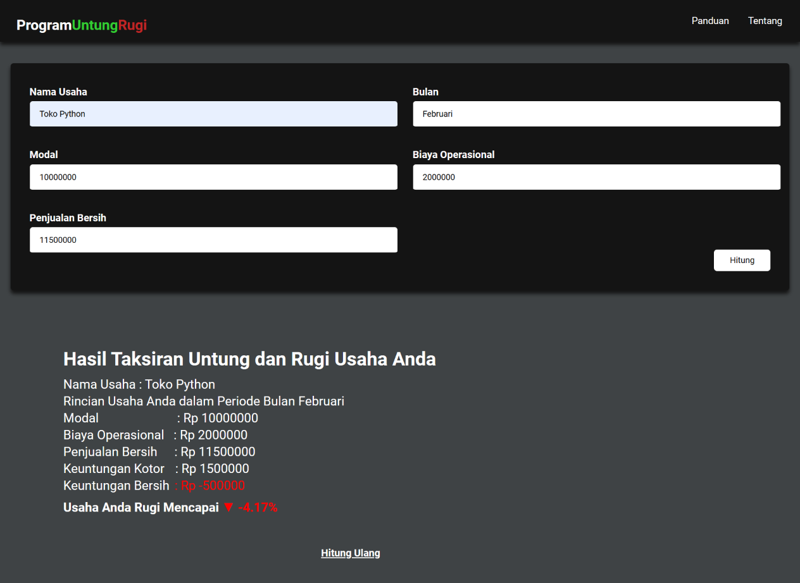

# Program Sederhana Hitung Untung Rugi Menggunakan Flask
Projek akhir mata kuliah Bahasa Pemrograman Python

## Tampilan Program 

#### Jika perhitngan Untung

#### Jika Perhitungan Rugi

#### Menu Panduan

Dibuat oleh
Galang Arsandy Noverdan Putra
